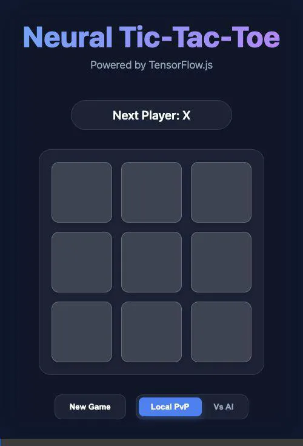

# Neural Tic-Tac-Toe

A premium "Neural" Tic-Tac-Toe experience powered by **SvelteKit** and **TensorFlow.js**.



## Features

- **Premium UI**: Modern dark theme with glassmorphism and smooth animations.
- **Neural Network AI**: A custom-trained TensorFlow.js model that learns to play Tic-Tac-Toe.
- **Real-time Probabilities**: See exactly what the AI is thinking with live win/tie probabilities.
- **Multiple Game Modes**:
  - **Local PvP**: Play against a friend on the same machine.
  - **Vs AI**: Challenge the neural network.
- **In-Browser Training**: Retrain the model anytime with a single click to see it learn in real-time.

## Project Structure

```
src/
	lib/
		Board.svelte
		Square.svelte
		tf/
			predictor.js
			trainer.js
	routes/
		+page.svelte
static/
	10/
	100/
	1000/
	10000/
documentation/
    app-demo-video.webp
```

## Developing

This project uses `npm` for dependency management.

Once you've installed dependencies, start a development server:

```bash
npm run dev
```

## AI Details

The AI is built using a sequential neural network in TensorFlow.js with:
- **Input Layer**: 9 nodes representing the board state.
- **Hidden Layers**: Dense layers with ReLU activation.
- **Output Layer**: 3 nodes with Softmax activation representing probabilities.

The training data is generated on-the-fly using a Minimax algorithm to ensure the model learns optimal strategy.
